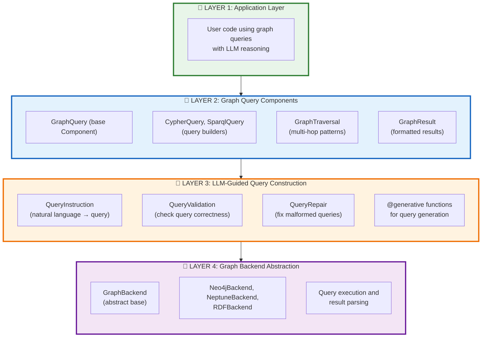
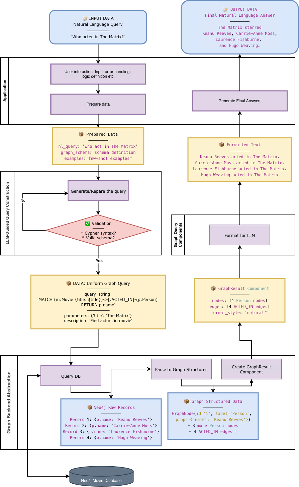

# Mellea Graph Query Library Design

## Vision

A graph query library that embodies Mellea's philosophy: **graph queries and results as Components that format for LLMs, with composable query building, validation/repair loops, and backend abstraction.**

## Core Philosophy Alignment

### 1. Components as Prompt Templates
Graph queries and results are **Components** with `format_for_llm()` that produce LLM-ready representations.

### 2. Instruct/Validate/Repair Loops
Query construction supports validation and iterative repair using Sampling Strategies.

### 3. Composability and Immutability
Query components compose naturally and follow functional patterns (immutable updates via `deepcopy`).

### 4. GraphDB Abstraction
Abstract over different graph databases (Neo4j, Neptune, RDF stores) similar to how Mellea abstracts LLM backends.

---

## Architecture Overview



The following is an example of how the data flow through the system when user give a question. (Note, we use neo4j database as an example but the implementation is graph database agnostic and the difference only exist in layer 4).


---

## Module Structure

**Location**: `mellea-contribs` repository (github.com/generative-computing/mellea-contribs)

**Dependencies**: All graph database and KG dependencies should be added to a `[kg]` dependency group in `pyproject.toml`

```
mellea-contribs/kg/
├── __init__.py                    # Public API exports
├── base.py                        # Core data structures
│   ├── GraphNode                  # Node dataclass
│   ├── GraphEdge                  # Edge dataclass
│   └── GraphPath                  # Path representation
│
├── graph_dbs/                     # Graph database backend implementations
│   ├── __init__.py
│   ├── base.py                    # GraphBackend (ABC)
│   ├── neo4j.py                   # Neo4j backend
│   ├── neptune.py                 # AWS Neptune backend
│   ├── rdf.py                     # RDF/SPARQL backend
│   └── mock.py                    # Mock backend for testing
│
├── components/                    # Graph Components (REQUIRED NAME)
│   ├── __init__.py
│   ├── query.py                   # GraphQuery, CypherQuery, SparqlQuery
│   ├── result.py                  # GraphResult component
│   ├── traversal.py               # GraphTraversal patterns
│   └── llm_guided.py              # LLM-guided query construction
│       ├── QueryInstruction       # NL → Query instruction
│       ├── @generative functions  # Query generation functions
│       └── query validation helpers
│
├── sampling/                      # Graph-specific sampling strategies (REQUIRED NAME)
│   ├── __init__.py
│   ├── validation.py              # QueryValidationStrategy
│   ├── traversal.py               # TraversalStrategy with pruning
│   └── extraction.py              # SubgraphExtractionStrategy
│
├── requirements/                  # Graph-specific requirements (REQUIRED NAME)
│   └── __init__.py                # All requirement functions
│       ├── is_valid_cypher()      # Cypher syntax validation
│       ├── is_valid_sparql()      # SPARQL syntax validation
│       ├── returns_results()      # Query returns non-empty results
│       └── respects_schema()      # Query respects graph schema
│
└── README.md                      # Documentation
```

---

## Core Design: Data Structures

### GraphNode and GraphEdge (Not Components)

These are pure data structures, not Components. They represent graph data.

```python
from dataclasses import dataclass
from typing import Any

@dataclass
class GraphNode:
    """A node in a graph.

    This is a dataclass, not a Component. It's just data.
    """
    id: str
    label: str  # Node type/label
    properties: dict[str, Any]

    @classmethod
    def from_neo4j_node(cls, node: Any) -> "GraphNode":
        """Create from Neo4j node object."""
        return cls(
            id=str(node.id),
            label=list(node.labels)[0] if node.labels else "Unknown",
            properties=dict(node.items()),
        )


@dataclass
class GraphEdge:
    """An edge in a graph.

    This is a dataclass, not a Component. It's just data.
    """
    id: str
    source: GraphNode
    label: str  # Relationship type
    target: GraphNode
    properties: dict[str, Any]

    @classmethod
    def from_neo4j_relationship(
        cls,
        rel: Any,
        source: GraphNode,
        target: GraphNode
    ) -> "GraphEdge":
        """Create from Neo4j relationship object."""
        return cls(
            id=str(rel.id),
            source=source,
            label=rel.type,
            target=target,
            properties=dict(rel.items()),
        )
```

**Key Design Principle**: Separate data (GraphNode, GraphEdge) from Components (GraphQuery, GraphResult). Components wrap data and provide `format_for_llm()`.

---

## Core Design: Components


### Mellea Component Pattern

Before implementing graph components, understand Mellea's Component pattern:

```python
# From mellea.stdlib.base
@runtime_checkable
class Component(Protocol):
    """A Component is a composite data structure intended to be represented to an LLM."""

    def parts(self) -> list[Component | CBlock]:
        """The constituent parts of the Component."""
        raise NotImplementedError("parts isn't implemented by default")

    def format_for_llm(self) -> TemplateRepresentation | str:
        """Formats the Component into a TemplateRepresentation or string."""
        raise NotImplementedError("format_for_llm isn't implemented by default")
```

**Key Mellea Patterns**:
1. ✅ **Private fields**: Use `self._field` for all internal state
2. ✅ **Public properties**: Use `@property` for read access
3. ✅ **blockify()**: Convert strings to CBlocks using `blockify()`
4. ✅ **Implement parts()**: Even if it just raises NotImplementedError
5. ✅ **TemplateRepresentation**: Always include `tools=None, images=None`
6. ✅ **template_order**: Always a list starting with `["*", "ComponentName"]`
7. ✅ **Immutability**: Use `deepcopy(self)` for creating modified copies

---

### 1. GraphQuery Component

Base Component for all graph queries.

```python
from mellea.stdlib.base import Component, TemplateRepresentation, CBlock, blockify
from copy import deepcopy
from typing import Any

class GraphQuery(Component):
    """Base Component for graph queries.

    Represents a graph query that can be executed against a GraphBackend
    and formatted for LLM consumption.

    Following Mellea patterns:
    - Private fields with _ prefix
    - Public properties for access
    - format_for_llm() returns TemplateRepresentation
    - Immutable updates via deepcopy
    """

    def __init__(
        self,
        query_string: str | CBlock | None = None,
        parameters: dict | None = None,
        description: str | CBlock | None = None,
        metadata: dict | None = None,
    ):
        """Initialize a graph query.

        Args:
            query_string: The actual query (Cypher, SPARQL, etc.)
            parameters: Query parameters for parameterized queries
            description: Natural language description of what the query does
            metadata: Additional metadata (schema hints, temporal constraints, etc.)
        """
        # MELLEA PATTERN: Store as private fields with _ prefix
        self._query_string = blockify(query_string) if query_string is not None else None
        self._parameters = parameters or {}
        self._description = blockify(description) if description is not None else None
        self._metadata = metadata or {}

    # MELLEA PATTERN: Public properties for access
    @property
    def query_string(self) -> str | None:
        """Get the query string."""
        return str(self._query_string) if self._query_string else None

    @property
    def parameters(self) -> dict:
        """Get query parameters."""
        return self._parameters

    @property
    def description(self) -> str | None:
        """Get description."""
        return str(self._description) if self._description else None

    # MELLEA PATTERN: Implement parts() even if raising
    def parts(self) -> list[Component | CBlock]:
        """The constituent parts of the query."""
        raise NotImplementedError("parts isn't implemented by default")

    # MELLEA PATTERN: format_for_llm returns TemplateRepresentation
    def format_for_llm(self) -> TemplateRepresentation:
        """Format query for LLM consumption.

        Returns a representation that shows:
        - What the query is trying to find (description)
        - The query structure (query_string)
        - Any constraints or parameters
        """
        return TemplateRepresentation(
            obj=self,
            args={
                "description": self.description or "Graph query",
                "query": self.query_string,
                "parameters": self._parameters,
                "metadata": self._metadata,
            },
            tools=None,  # MELLEA PATTERN: Always include
            images=None,  # MELLEA PATTERN: Always include
            template_order=["*", "GraphQuery"],  # MELLEA PATTERN: List with "*" first
        )

    # MELLEA PATTERN: Immutable updates using deepcopy
    def with_description(self, description: str | CBlock) -> "GraphQuery":
        """Return new query with updated description (immutable).

        Following Mellea's copy_and_repair pattern from Instruction.
        """
        result = deepcopy(self)
        result._description = blockify(description) if description is not None else None
        return result

    def with_parameters(self, **params) -> "GraphQuery":
        """Return new query with updated parameters (immutable)."""
        result = deepcopy(self)
        result._parameters = {**self._parameters, **params}
        return result

    def with_metadata(self, **metadata) -> "GraphQuery":
        """Return new query with updated metadata (immutable)."""
        result = deepcopy(self)
        result._metadata = {**self._metadata, **metadata}
        return result
```

---

### 2. CypherQuery Component

Composable Cypher query builder with fluent interface.

```python
class CypherQuery(GraphQuery):
    """Component for building Cypher queries (Neo4j).

    Provides a fluent, composable interface for building Cypher queries
    that follows Mellea's immutability patterns (like Instruction).

    Example:
        query = (
            CypherQuery()
            .match("(m:Movie)")
            .where("m.year = $year")
            .return_("m.title", "m.year")
            .order_by("m.year DESC")
            .limit(10)
            .with_parameters(year=2020)
        )
    """

    def __init__(
        self,
        query_string: str | CBlock | None = None,
        parameters: dict | None = None,
        description: str | CBlock | None = None,
        metadata: dict | None = None,
        # Query clauses (for composable building)
        match_clauses: list[str] | None = None,
        where_clauses: list[str] | None = None,
        return_clauses: list[str] | None = None,
        order_by: list[str] | None = None,
        limit: int | None = None,
    ):
        """Initialize Cypher query builder."""
        # MELLEA PATTERN: Store clauses as private fields
        self._match_clauses = match_clauses or []
        self._where_clauses = where_clauses or []
        self._return_clauses = return_clauses or []
        self._order_by = order_by or []
        self._limit = limit

        # Build query string from clauses if not provided
        if query_string is None and match_clauses:
            query_string = self._build_query_string(
                self._match_clauses,
                self._where_clauses,
                self._return_clauses,
                self._order_by,
                self._limit
            )

        # Call parent constructor
        super().__init__(query_string, parameters, description, metadata)

    @staticmethod
    def _build_query_string(match, where, return_, order, limit) -> str:
        """Build Cypher query string from clauses."""
        parts = []
        if match:
            parts.append("MATCH " + ", ".join(match))
        if where:
            parts.append("WHERE " + " AND ".join(where))
        if return_:
            parts.append("RETURN " + ", ".join(return_))
        if order:
            parts.append("ORDER BY " + ", ".join(order))
        if limit:
            parts.append(f"LIMIT {limit}")
        return "\n".join(parts)

    # MELLEA PATTERN: Fluent builder methods using deepcopy for immutability
    def match(self, pattern: str) -> "CypherQuery":
        """Add a MATCH clause (immutable).

        Returns a new CypherQuery with the clause added.
        """
        result = deepcopy(self)
        result._match_clauses = [*self._match_clauses, pattern]
        result._query_string = blockify(result._build_query_string(
            result._match_clauses,
            result._where_clauses,
            result._return_clauses,
            result._order_by,
            result._limit,
        ))
        return result

    def where(self, condition: str) -> "CypherQuery":
        """Add a WHERE clause (immutable)."""
        result = deepcopy(self)
        result._where_clauses = [*self._where_clauses, condition]
        result._query_string = blockify(result._build_query_string(
            result._match_clauses,
            result._where_clauses,
            result._return_clauses,
            result._order_by,
            result._limit,
        ))
        return result

    def return_(self, *items: str) -> "CypherQuery":
        """Add a RETURN clause (immutable)."""
        result = deepcopy(self)
        result._return_clauses = [*self._return_clauses, *items]
        result._query_string = blockify(result._build_query_string(
            result._match_clauses,
            result._where_clauses,
            result._return_clauses,
            result._order_by,
            result._limit,
        ))
        return result

    def order_by(self, *fields: str) -> "CypherQuery":
        """Add ORDER BY clause (immutable)."""
        result = deepcopy(self)
        result._order_by = [*self._order_by, *fields]
        result._query_string = blockify(result._build_query_string(
            result._match_clauses,
            result._where_clauses,
            result._return_clauses,
            result._order_by,
            result._limit,
        ))
        return result

    def limit(self, n: int) -> "CypherQuery":
        """Add LIMIT clause (immutable)."""
        result = deepcopy(self)
        result._limit = n
        result._query_string = blockify(result._build_query_string(
            result._match_clauses,
            result._where_clauses,
            result._return_clauses,
            result._order_by,
            result._limit,
        ))
        return result

    # MELLEA PATTERN: format_for_llm with proper template_order
    def format_for_llm(self) -> TemplateRepresentation:
        """Format Cypher query for LLM."""
        return TemplateRepresentation(
            obj=self,
            args={
                "description": self.description or "Cypher graph query",
                "query": self.query_string,
                "parameters": self._parameters,
                "query_type": "Cypher (Neo4j)",
            },
            tools=None,
            images=None,
            template_order=["*", "CypherQuery", "GraphQuery"],  # Inheritance chain
        )
```

---

### 3. GraphResult Component

Represents query results formatted for LLM consumption.

```python
class GraphResult(Component):
    """Component for graph query results.

    Formats query results in LLM-friendly ways:
    - "triplets": (subject, predicate, object) format
    - "natural": Natural language descriptions
    - "paths": Path narratives
    - "structured": JSON/XML representations

    Following Mellea patterns:
    - Private fields, public properties
    - format_for_llm() with multiple style options
    - Can be used in Instruction.grounding_context
    """

    def __init__(
        self,
        nodes: list[GraphNode] | None = None,
        edges: list[GraphEdge] | None = None,
        paths: list[list[GraphNode | GraphEdge]] | None = None,
        raw_result: Any | None = None,
        query: GraphQuery | None = None,
        format_style: str = "triplets",
    ):
        """Initialize graph result.

        Args:
            nodes: List of nodes in the result
            edges: List of edges in the result
            paths: List of paths (sequences of nodes/edges)
            raw_result: Raw result from backend
            query: The query that produced this result
            format_style: "triplets", "natural", "paths", "structured"
        """
        # MELLEA PATTERN: Private fields
        self._nodes = nodes or []
        self._edges = edges or []
        self._paths = paths or []
        self._raw_result = raw_result
        self._query = query
        self._format_style = format_style

    # MELLEA PATTERN: Public properties
    @property
    def nodes(self) -> list[GraphNode]:
        """Get result nodes."""
        return self._nodes

    @property
    def edges(self) -> list[GraphEdge]:
        """Get result edges."""
        return self._edges

    @property
    def paths(self) -> list[list[GraphNode | GraphEdge]]:
        """Get result paths."""
        return self._paths

    # MELLEA PATTERN: Implement parts()
    def parts(self) -> list[Component | CBlock]:
        """The constituent parts."""
        raise NotImplementedError("parts isn't implemented by default")

    # MELLEA PATTERN: format_for_llm returns TemplateRepresentation
    def format_for_llm(self) -> TemplateRepresentation:
        """Format result for LLM based on format_style."""
        formatted_content = self._format_based_on_style()

        return TemplateRepresentation(
            obj=self,
            args={
                "query_description": self._query.description if self._query else None,
                "result_count": len(self._nodes) + len(self._edges) + len(self._paths),
                "content": formatted_content,
                "format_style": self._format_style,
            },
            tools=None,
            images=None,
            template_order=["*", "GraphResult"],
        )

    def _format_based_on_style(self) -> str:
        """Format results based on the selected style."""
        if self._format_style == "triplets":
            return self._format_as_triplets()
        elif self._format_style == "natural":
            return self._format_as_natural_text()
        elif self._format_style == "paths":
            return self._format_as_paths()
        elif self._format_style == "structured":
            return self._format_as_structured()
        else:
            return str(self._raw_result)

    def _format_as_triplets(self) -> str:
        """Format as (subject, predicate, object) triplets."""
        lines = []
        for i, edge in enumerate(self._edges):
            source = edge.source.label
            relation = edge.label
            target = edge.target.label
            lines.append(f"  {i+1}. ({source})-[{relation}]->({target})")
        return "\n".join(lines) if lines else "No edges found"

    def _format_as_natural_text(self) -> str:
        """Format as natural language descriptions."""
        descriptions = []
        for edge in self._edges:
            source = edge.source.label
            relation = edge.label.replace("_", " ").lower()
            target = edge.target.label
            descriptions.append(f"{source} {relation} {target}")
        return ". ".join(descriptions) + "." if descriptions else "No relationships found"

    def _format_as_paths(self) -> str:
        """Format as path descriptions."""
        path_descriptions = []
        for i, path in enumerate(self._paths):
            elements = []
            for item in path:
                if isinstance(item, GraphNode):
                    elements.append(f"[{item.label}]")
                elif isinstance(item, GraphEdge):
                    elements.append(f"-{item.label}->")
            path_descriptions.append(f"  Path {i+1}: " + "".join(elements))
        return "\n".join(path_descriptions) if path_descriptions else "No paths found"

    def _format_as_structured(self) -> str:
        """Format as structured JSON."""
        import json
        data = {
            "nodes": [
                {"id": n.id, "label": n.label, "properties": n.properties}
                for n in self._nodes
            ],
            "edges": [
                {"source": e.source.id, "label": e.label, "target": e.target.id}
                for e in self._edges
            ],
        }
        return json.dumps(data, indent=2)
```

---

### 4. GraphTraversal Component

High-level traversal patterns (BFS, DFS, multi-hop, shortest path).

```python
from typing import Callable

class GraphTraversal(Component):
    """High-level graph traversal patterns.

    Provides common traversal patterns that work across different backends:
    - "bfs": Breadth-first search
    - "dfs": Depth-first search
    - "multi_hop": Variable-length path traversal
    - "shortest_path": Shortest path between nodes

    Following Mellea patterns for Component implementation.
    """

    def __init__(
        self,
        start_nodes: list[str],
        pattern: str = "multi_hop",
        max_depth: int = 3,
        edge_filter: Callable[[GraphEdge], bool] | None = None,
        node_filter: Callable[[GraphNode], bool] | None = None,
        description: str | CBlock | None = None,
    ):
        """Initialize a traversal pattern.

        Args:
            start_nodes: Starting node IDs or labels
            pattern: "bfs", "dfs", "multi_hop", "shortest_path"
            max_depth: Maximum depth to traverse
            edge_filter: Optional filter function for edges
            node_filter: Optional filter function for nodes
            description: Description of traversal intent
        """
        # MELLEA PATTERN: Private fields
        self._start_nodes = start_nodes
        self._pattern = pattern
        self._max_depth = max_depth
        self._edge_filter = edge_filter
        self._node_filter = node_filter
        self._description = blockify(description) if description is not None else None

    # MELLEA PATTERN: Public properties
    @property
    def start_nodes(self) -> list[str]:
        return self._start_nodes

    @property
    def pattern(self) -> str:
        return self._pattern

    @property
    def max_depth(self) -> int:
        return self._max_depth

    # MELLEA PATTERN: Implement parts()
    def parts(self) -> list[Component | CBlock]:
        raise NotImplementedError("parts isn't implemented by default")

    # MELLEA PATTERN: format_for_llm
    def format_for_llm(self) -> TemplateRepresentation:
        """Format traversal for LLM."""
        description = str(self._description) if self._description else "Graph traversal"

        return TemplateRepresentation(
            obj=self,
            args={
                "description": description,
                "start_nodes": self._start_nodes,
                "pattern": self._pattern,
                "max_depth": self._max_depth,
            },
            tools=None,
            images=None,
            template_order=["*", "GraphTraversal"],
        )

    def to_cypher(self) -> CypherQuery:
        """Convert traversal to Cypher query.

        This allows high-level traversal patterns to be compiled
        to backend-specific queries.
        """
        if self._pattern == "multi_hop":
            # Variable-length path pattern
            match_pattern = f"(start)-[*1..{self._max_depth}]->(end)"
            description = f"Multi-hop traversal from {self._start_nodes}"

            return (
                CypherQuery()
                .match(match_pattern)
                .where(f"start.id IN {self._start_nodes}")
                .return_("start", "end")
                .with_description(description)
            )
        elif self._pattern == "shortest_path":
            match_pattern = f"path = shortestPath((start)-[*1..{self._max_depth}]->(end))"
            description = f"Shortest path from {self._start_nodes}"

            return (
                CypherQuery()
                .match(match_pattern)
                .where(f"start.id IN {self._start_nodes}")
                .return_("path")
                .with_description(description)
            )
        else:
            raise ValueError(f"Unknown pattern: {self._pattern}")
```

---

## Core Design: Backends

### GraphBackend (Abstract Base)

Similar to Mellea's `Backend` abstraction for LLMs, but for graph databases.

```python
from abc import ABC, abstractmethod
from typing import Any

class GraphBackend(ABC):
    """Abstract backend for graph databases.

    Provides a unified interface for executing graph queries across
    different graph database systems (Neo4j, Neptune, RDF stores, etc.).

    Following Mellea's Backend pattern:
    - Takes backend_id (like model_id)
    - Takes backend_options (like model_options)
    - Abstract methods for core operations
    """

    def __init__(
        self,
        backend_id: str,
        *,
        connection_uri: str | None = None,
        auth: tuple[str, str] | None = None,
        database: str | None = None,
        backend_options: dict | None = None,
    ):
        """Initialize graph backend.

        Following Mellea's Backend(model_id, model_options) pattern.

        Args:
            backend_id: Identifier for backend type (e.g., "neo4j", "neptune")
            connection_uri: URI for connecting to the database
            auth: (username, password) tuple for authentication
            database: Database name (if multi-database system)
            backend_options: Backend-specific options
        """
        # MELLEA PATTERN: Similar to Backend.__init__
        self.backend_id = backend_id
        self.backend_options = backend_options if backend_options is not None else {}

        # Graph-specific fields
        self.connection_uri = connection_uri
        self.auth = auth
        self.database = database

    @abstractmethod
    async def execute_query(
        self,
        query: GraphQuery,
        **execution_options,
    ) -> GraphResult:
        """Execute a graph query and return results.

        Similar to Backend.generate_from_context() for LLMs.
        Takes a Component (GraphQuery), returns a Component (GraphResult).

        Args:
            query: The GraphQuery Component to execute
            execution_options: Backend-specific execution options

        Returns:
            GraphResult Component containing formatted results
        """
        ...

    @abstractmethod
    async def get_schema(self) -> dict[str, Any]:
        """Get the graph schema.

        Returns:
            Dictionary with node_types, edge_types, properties, etc.
        """
        ...

    @abstractmethod
    async def validate_query(self, query: GraphQuery) -> tuple[bool, str | None]:
        """Validate query syntax and semantics.

        Returns:
            (is_valid, error_message)
        """
        ...

    def supports_query_type(self, query_type: str) -> bool:
        """Check if this backend supports a query type (Cypher, SPARQL, etc.).

        Default implementation returns False. Subclasses should override.
        """
        return False

    async def execute_traversal(
        self,
        traversal: GraphTraversal,
        **execution_options,
    ) -> GraphResult:
        """Execute a high-level traversal pattern.

        Default implementation converts to backend-specific query.
        """
        if self.supports_query_type("cypher"):
            query = traversal.to_cypher()
            return await self.execute_query(query, **execution_options)
        else:
            raise NotImplementedError(
                f"Traversal not implemented for {self.__class__.__name__}"
            )
```

---

### Neo4jBackend (Concrete Implementation)

```python
import neo4j
from typing import Any

class Neo4jBackend(GraphBackend):
    """Neo4j implementation of GraphBackend.

    Implements the abstract GraphBackend interface for Neo4j databases.
    """

    def __init__(
        self,
        connection_uri: str = "bolt://localhost:7687",
        auth: tuple[str, str] | None = None,
        database: str | None = None,
        backend_options: dict | None = None,
    ):
        """Initialize Neo4j backend.

        Args:
            connection_uri: Neo4j connection URI
            auth: (username, password) tuple
            database: Database name (for multi-database)
            backend_options: Neo4j-specific options
        """
        # Call parent constructor following Mellea pattern
        super().__init__(
            backend_id="neo4j",
            connection_uri=connection_uri,
            auth=auth,
            database=database,
            backend_options=backend_options,
        )

        # Create Neo4j drivers
        self._driver = neo4j.GraphDatabase.driver(
            connection_uri,
            auth=auth,
        )
        self._async_driver = neo4j.AsyncGraphDatabase.driver(
            connection_uri,
            auth=auth,
        )

    async def execute_query(
        self,
        query: GraphQuery,
        **execution_options,
    ) -> GraphResult:
        """Execute a query in Neo4j.

        Takes a GraphQuery Component, executes it, returns GraphResult Component.
        """
        # Get query string and parameters
        query_string = query.query_string
        parameters = query.parameters

        if not query_string:
            raise ValueError("Query string is empty")

        # Execute query
        async with self._async_driver.session(database=self.database) as session:
            result = await session.run(query_string, parameters)
            records = [record async for record in result]

        # Parse results into nodes, edges, paths
        nodes, edges, paths = self._parse_neo4j_result(records)

        # Return GraphResult Component
        return GraphResult(
            nodes=nodes,
            edges=edges,
            paths=paths,
            raw_result=records,
            query=query,
            format_style=execution_options.get("format_style", "triplets"),
        )

    def _parse_neo4j_result(
        self,
        records
    ) -> tuple[list[GraphNode], list[GraphEdge], list]:
        """Parse Neo4j records into GraphNode and GraphEdge objects."""
        nodes = []
        edges = []
        paths = []

        node_cache = {}  # Cache nodes by ID for edge creation

        for record in records:
            for key in record.keys():
                value = record[key]

                if isinstance(value, neo4j.graph.Node):
                    node = GraphNode.from_neo4j_node(value)
                    node_cache[node.id] = node
                    nodes.append(node)

                elif isinstance(value, neo4j.graph.Relationship):
                    # Get source and target nodes
                    source_id = str(value.start_node.id)
                    target_id = str(value.end_node.id)

                    # Get from cache or create
                    if source_id not in node_cache:
                        node_cache[source_id] = GraphNode.from_neo4j_node(value.start_node)
                    if target_id not in node_cache:
                        node_cache[target_id] = GraphNode.from_neo4j_node(value.end_node)

                    source = node_cache[source_id]
                    target = node_cache[target_id]

                    edge = GraphEdge.from_neo4j_relationship(value, source, target)
                    edges.append(edge)

                elif isinstance(value, neo4j.graph.Path):
                    # Parse path into alternating nodes and edges
                    path_items = []
                    for node in value.nodes:
                        path_items.append(GraphNode.from_neo4j_node(node))
                    for rel in value.relationships:
                        src = GraphNode.from_neo4j_node(rel.start_node)
                        tgt = GraphNode.from_neo4j_node(rel.end_node)
                        path_items.append(GraphEdge.from_neo4j_relationship(rel, src, tgt))
                    paths.append(path_items)

        return nodes, edges, paths

    async def get_schema(self) -> dict[str, Any]:
        """Get Neo4j schema.

        Queries for node labels, relationship types, and property keys.
        """
        # Get node labels
        labels_query = "CALL db.labels() YIELD label RETURN collect(label) as labels"
        labels_result = await self.execute_query(
            CypherQuery(query_string=labels_query)
        )

        # Get relationship types
        types_query = "CALL db.relationshipTypes() YIELD relationshipType RETURN collect(relationshipType) as types"
        types_result = await self.execute_query(
            CypherQuery(query_string=types_query)
        )

        # This is simplified - real implementation would extract from results
        return {
            "node_types": [],  # Would parse from labels_result
            "edge_types": [],  # Would parse from types_result
            "properties": {},  # Would need additional queries
        }

    async def validate_query(self, query: GraphQuery) -> tuple[bool, str | None]:
        """Validate Cypher query syntax.

        Uses Neo4j's EXPLAIN to validate without executing.
        """
        try:
            explain_query = f"EXPLAIN {query.query_string}"
            async with self._async_driver.session(database=self.database) as session:
                await session.run(explain_query, query.parameters)
            return True, None
        except neo4j.exceptions.CypherSyntaxError as e:
            return False, str(e)
        except Exception as e:
            return False, f"Validation error: {str(e)}"

    def supports_query_type(self, query_type: str) -> bool:
        """Neo4j supports Cypher queries."""
        return query_type.lower() == "cypher"

    async def close(self):
        """Close Neo4j connections."""
        await self._async_driver.close()
```

---

## LLM-Guided Query Construction

### @generative Functions for Query Generation

Following Mellea's @generative pattern for NL → Query generation.

```python
from mellea.stdlib.genslot import generative
from pydantic import BaseModel
from typing import Any

class GeneratedQuery(BaseModel):
    """Pydantic model for generated query output."""
    query: str
    explanation: str
    parameters: dict[str, Any] | None = None


@generative
async def natural_language_to_cypher(
    natural_language_query: str,
    graph_schema: str,
    examples: str,
) -> GeneratedQuery:
    """Generate a Cypher query from natural language.

    Given a natural language question and the graph schema, generate a
    valid Cypher query that answers the question.

    Graph Schema:
    {graph_schema}

    Examples:
    {examples}

    Question: {natural_language_query}

    Generate a Cypher query to answer this question. Return as JSON:
    {{"query": "MATCH ...", "explanation": "This query...", "parameters": {{}}}}

    Query:"""
    pass


@generative
async def explain_query_result(
    query: str,
    result: str,
    original_question: str,
) -> str:
    """Explain a graph query result in natural language.

    Original Question: {original_question}

    Query Executed:
    {query}

    Results:
    {result}

    Explain what these results mean in relation to the original question.
    Write a clear, natural language answer.

    Answer:"""
    pass


@generative
async def suggest_query_improvement(
    query: str,
    error_message: str,
    schema: str,
) -> GeneratedQuery:
    """Suggest an improved query based on an error.

    The following query failed:
    {query}

    Error: {error_message}

    Graph Schema:
    {schema}

    Suggest a corrected version of the query. Return as JSON:
    {{"query": "...", "explanation": "The issue was...", "parameters": {{}}}}

    Corrected Query:"""
    pass
```

---

## Sampling Strategies

### QueryValidationStrategy

Uses Instruct/Validate/Repair pattern for query generation.

```python
from mellea.stdlib.sampling import BaseSamplingStrategy
from mellea.stdlib.base import Context, Component, ModelOutputThunk, CBlock
from mellea.stdlib.requirement import Requirement, ValidationResult

class QueryValidationStrategy(BaseSamplingStrategy):
    """Sampling strategy for generating and validating graph queries.

    Uses Instruct/Validate/Repair pattern:
    1. Generate query from NL
    2. Validate syntax and executability
    3. If invalid, repair using error feedback

    Following Mellea's BaseSamplingStrategy pattern.
    """

    def __init__(
        self,
        backend: GraphBackend,
        loop_budget: int = 3,
        requirements: list[Requirement] | None = None,
    ):
        """Initialize strategy.

        Args:
            backend: Graph backend for validation
            loop_budget: Max repair attempts
            requirements: Query validation requirements
        """
        super().__init__(loop_budget=loop_budget, requirements=requirements)
        self._backend = backend

    @staticmethod
    def repair(
        old_ctx: Context,
        new_ctx: Context,
        past_actions: list[Component],
        past_results: list[ModelOutputThunk],
        past_val: list[list[tuple[Requirement, ValidationResult]]],
    ) -> tuple[Component, Context]:
        """Repair failed query using error feedback.

        Following Mellea's repair pattern.
        """
        # Get the last validation failure
        last_validation = past_val[-1]

        # Extract error messages
        error_messages = []
        for req, result in last_validation:
            if not result.result and result.reason:
                error_messages.append(result.reason)

        # Get the failed query
        failed_query = past_results[-1].value

        # Create repair instruction using CBlock
        repair_instruction = CBlock(
            f"The previous query failed validation:\n"
            f"Query: {failed_query}\n"
            f"Errors: {', '.join(error_messages)}\n"
            f"Please generate a corrected query."
        )

        return repair_instruction, new_ctx

    @staticmethod
    def select_from_failure(
        sampled_actions: list[Component],
        sampled_results: list[ModelOutputThunk],
        sampled_val: list[list[tuple[Requirement, ValidationResult]]],
    ) -> int:
        """Select best query when all attempts failed.

        Returns the query with the fewest validation errors.
        """
        error_counts = []
        for validation in sampled_val:
            error_count = sum(1 for _, result in validation if not result.result)
            error_counts.append(error_count)

        return error_counts.index(min(error_counts))
```

---

## Requirements

### Graph-Specific Requirements

```python
from mellea.stdlib.requirement import Requirement, ValidationResult
from mellea.stdlib.base import Context

def is_valid_cypher(backend: GraphBackend) -> Requirement:
    """Requirement: Query must be valid Cypher syntax."""

    async def validate(ctx: Context) -> ValidationResult:
        query_string = ctx.last_assistant_message.as_str()
        query = CypherQuery(query_string=query_string)

        is_valid, error = await backend.validate_query(query)

        return ValidationResult(
            result=is_valid,
            reason=error if not is_valid else "Valid Cypher syntax",
        )

    return Requirement(
        description="Query must be valid Cypher syntax",
        validation_fn=validate,
    )


def returns_results(backend: GraphBackend) -> Requirement:
    """Requirement: Query must return non-empty results."""

    async def validate(ctx: Context) -> ValidationResult:
        query_string = ctx.last_assistant_message.as_str()
        query = CypherQuery(query_string=query_string)

        result = await backend.execute_query(query)
        has_results = len(result.nodes) > 0 or len(result.edges) > 0

        return ValidationResult(
            result=has_results,
            reason="Query returned results" if has_results else "Query returned no results",
        )

    return Requirement(
        description="Query must return non-empty results",
        validation_fn=validate,
    )


def respects_schema(backend: GraphBackend) -> Requirement:
    """Requirement: Query must only reference valid node/edge types from schema."""

    async def validate(ctx: Context) -> ValidationResult:
        query_string = ctx.last_assistant_message.as_str()
        schema = await backend.get_schema()

        # Would need actual Cypher parsing logic
        # For now, simplified validation

        return ValidationResult(
            result=True,
            reason="Query respects schema",
        )

    return Requirement(
        description="Query must only reference valid schema types",
        validation_fn=validate,
    )
```

---

## End-to-End Flow Example

This example shows how the different layers work together when processing a natural language query about a knowledge graph.

### Flow Description

**User Query**: "Who acted in The Matrix?"

**Layer 1 - Application Layer**:
- **Input**: Natural language question
- **Action**: Initiates graph query workflow
- **Component**: Application code (could be KGRag or custom implementation)

**Layer 2 - Query Construction**:
- **Input**: Query intent + graph schema
- **Action**: Build structured Cypher query
- **Output**: CypherQuery with query string, parameters, and description
  ```
  query_string: "MATCH (m:Movie {title: $title})<-[:ACTED_IN]-(p:Person) RETURN p"
  parameters: {"title": "The Matrix"}
  ```

**Layer 3 - LLM-Guided Validation**:
- **Input**: CypherQuery
- **Action**: Validate query against schema and syntax rules
- **Checks**:
  - Valid Cypher syntax?
  - Uses valid node/edge types from schema?
  - Likely to return results?
- **Output**: Validated query (or repaired query if validation failed)

**Layer 4 - Backend Execution**:
- **Input**: Validated CypherQuery
- **Action**: Execute query against Neo4j database
- **Process**:
  - Submit Cypher to Neo4j
  - Receive raw Neo4j records
  - Parse records into GraphNode and GraphEdge objects
- **Output**: Structured graph data (nodes and edges)

**Layer 2 - Result Formatting**:
- **Input**: Raw graph nodes and edges
- **Action**: Create GraphResult and format for LLM consumption
- **Output**: LLM-readable representation
  ```
  Format styles available:
  - "triplets": (Person)-[ACTED_IN]->(Movie)
  - "natural": "Keanu Reeves acted in The Matrix"
  - "paths": Path descriptions through graph
  - "structured": JSON representation
  ```

**Layer 1 - Answer Generation**:
- **Input**: Original question + formatted graph data
- **Action**: LLM generates natural language answer using graph context
- **Output**: "Keanu Reeves and Carrie-Anne Moss acted in The Matrix."

### Flow Diagram


### Key Design Points

1. **Not Everything is a Component**:
   - `GraphNode` and `GraphEdge` are pure dataclasses (just data)
   - `CypherQuery` and `GraphResult` are Components (have `format_for_llm()`)
   - Application layer code is not a Component

2. **Layer 2 Components are Created BY Other Layers**:
   - Layer 2 defines the Component classes (`CypherQuery`, `GraphResult`)
   - Layer 3 **creates** CypherQuery instances via `@generative` functions
   - Layer 4 **creates** GraphResult instances when returning query results
   - Layer 2 is not a processing step - it's a library of Component definitions

3. **Actual Processing Flow** (for "who act in The Matrix"):
   - **Layer 1**: Receives NL query → passes to Layer 3
   - **Layer 3**: LLM converts NL → CypherQuery Component → validates → repairs if needed
   - **Layer 4**: Executes CypherQuery → parses results → creates GraphResult Component
   - **Layer 1**: Uses GraphResult.format_for_llm() → LLM generates final answer

4. **Clear Layer Responsibilities**:
   - **Layer 1** (Application): Orchestration and answer generation
   - **Layer 2** (Components): Defines data structures with `format_for_llm()`
   - **Layer 3** (LLM-Guided): Query generation, validation, and repair
   - **Layer 4** (Backend): Database execution and result parsing

5. **Data Transformations**:
   - Natural language → CypherQuery Component → Validated query → Neo4j records → GraphNode/GraphEdge → GraphResult Component → Formatted text → Natural language answer

---

## Usage Examples

### Example 1: Simple Query Building

```python
from mellea_contribs.kg.components import CypherQuery
from mellea_contribs.kg.graph_dbs import Neo4jBackend

# Create backend
backend = Neo4jBackend(
    connection_uri="bolt://localhost:7687",
    auth=("neo4j", "password"),
)

# Build query using fluent interface (immutable - each call returns new instance)
query = (
    CypherQuery()
    .match("(m:Movie)")
    .where("m.year = $year")
    .return_("m.title", "m.year")
    .order_by("m.year DESC")
    .limit(10)
    .with_parameters(year=2020)
    .with_description("Find 10 movies from 2020")
)

# Execute query
result = await backend.execute_query(query, format_style="natural")

# Result is a Component - can be formatted for LLM
print(result.format_for_llm())
```

### Example 2: LLM-Guided Query Construction

```python
from mellea_contribs.kg.components import CypherQuery
from mellea_contribs.kg.components.llm_guided import natural_language_to_cypher
from mellea_contribs.kg.sampling import QueryValidationStrategy
from mellea_contribs.kg.requirements import is_valid_cypher, returns_results
from mellea_contribs.kg.graph_dbs import Neo4jBackend
from mellea import MelleaSession

# Create Mellea session for LLM
session = MelleaSession(...)

# Create graph backend
graph_backend = Neo4jBackend(...)

# Get graph schema
schema = await graph_backend.get_schema()

# Use @generative to convert NL → Cypher
query_result, _ = await natural_language_to_cypher(
    session.ctx,
    session.backend,
    natural_language_query="Find all movies directed by Christopher Nolan",
    graph_schema=format_schema(schema),
    examples=get_few_shot_examples(),
)

# Create query from generated output
query = CypherQuery(query_string=query_result.query)

# Execute with validation strategy
strategy = QueryValidationStrategy(
    backend=graph_backend,
    loop_budget=3,
)

# This will validate and auto-repair if needed
sampling_result = await strategy.sample(
    action=query,
    context=session.ctx,
    backend=session.backend,
    requirements=[
        is_valid_cypher(graph_backend),
        returns_results(graph_backend),
    ],
)

# Get the final valid query
final_query = sampling_result.value
result = await graph_backend.execute_query(final_query)
```

### Example 3: Graph Results in LLM Reasoning

```python
from mellea_contribs.kg.components import CypherQuery
from mellea.stdlib.instruction import Instruction

# Query graph
query = (
    CypherQuery()
    .match("(a:Actor)-[:ACTED_IN]->(m:Movie)")
    .where("m.genre = 'Sci-Fi'")
    .return_("a.name", "m.title")
    .limit(20)
    .with_description("Find actors in sci-fi movies")
)

result = await backend.execute_query(query, format_style="triplets")

# Use result in downstream LLM reasoning
instruction = Instruction(
    description="Answer the question using the graph context",
    grounding_context={
        "graph_knowledge": result,  # Result is a Component!
    },
)

# The formatter will call result.format_for_llm() automatically
answer, _ = await session.backend.generate_from_context(
    action=instruction,
    ctx=session.ctx,
)
```

### Example 4: Multi-Hop Traversal

```python
from mellea_contribs.kg.components import GraphTraversal

# Define traversal
traversal = GraphTraversal(
    start_nodes=["Christopher Nolan"],
    pattern="multi_hop",
    max_depth=3,
    description="Find entities connected to Christopher Nolan within 3 hops",
)

# Execute traversal (converts to Cypher internally)
result = await backend.execute_traversal(traversal, format_style="paths")

# Result shows paths through the graph
print(result.format_for_llm())
```

---

## Benefits of This Design

1. **Philosophical Alignment**: Everything is a Component with `format_for_llm()`
2. **Follows Mellea Patterns**: Private fields, properties, deepcopy, TemplateRepresentation
3. **Composability**: Fluent query building with immutable updates
4. **Backend Abstraction**: Swap Neo4j ↔ Neptune ↔ RDF seamlessly
5. **LLM Integration**: Natural language → Query with validation/repair
6. **Result Formatting**: Multiple styles for different LLM reasoning tasks
7. **Reusability**: Works standalone or as KGRag foundation

---

## Implementation Plan

### Phase 1: Core Data Structures
1. Implement `base.py` with GraphNode, GraphEdge dataclasses
2. Write tests for data structure creation and serialization

### Phase 2: Components
1. Implement `components.py`:
   - GraphQuery (base component)
   - CypherQuery (with fluent builder)
   - GraphResult (with format styles)
   - GraphTraversal (high-level patterns)
2. Write tests for Component protocol compliance
3. Verify format_for_llm() output

### Phase 3: Backends
1. Implement `backends/base.py` with GraphBackend ABC
2. Implement `backends/neo4j.py` with Neo4jBackend
3. Implement `backends/mock.py` for testing
4. Write integration tests with actual Neo4j instance

### Phase 4: LLM-Guided Features
1. Implement `llm_guided.py` with @generative functions
2. Implement `sampling.py` with QueryValidationStrategy
3. Implement `requirements.py` with validation functions
4. Write end-to-end tests for NL → Query generation

### Phase 5: Documentation & Examples
1. Write comprehensive README
2. Create usage examples
3. Document integration with KGRag
4. Write API reference

---

## Open Questions

1. **Query Optimization**: Should we include query optimization hints?
2. **Caching**: Should query results be cached at the Component level?
3. **Streaming**: Support for streaming large result sets?
4. **Graph Algorithms**: Include common algorithms (PageRank, community detection)?
5. **Vector Search**: Integration with vector indices for semantic search?
6. **Multi-Backend Queries**: Support queries across multiple graph backends?

---

This design creates a **Graph Query library that truly embodies Mellea's philosophy** while being practical and extensible. It treats graph queries and results as first-class Components, follows Mellea's established patterns, and integrates naturally with LLM-based reasoning.
